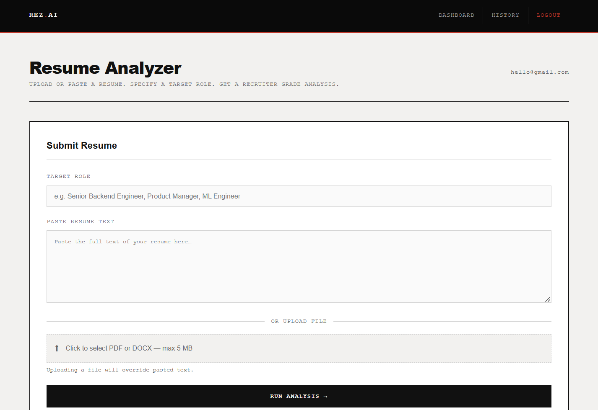
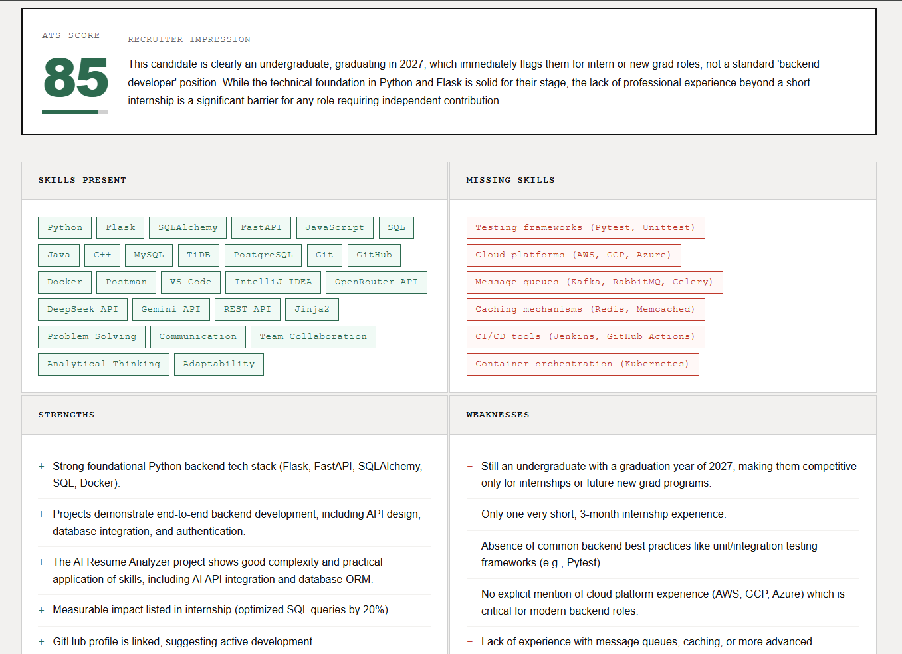
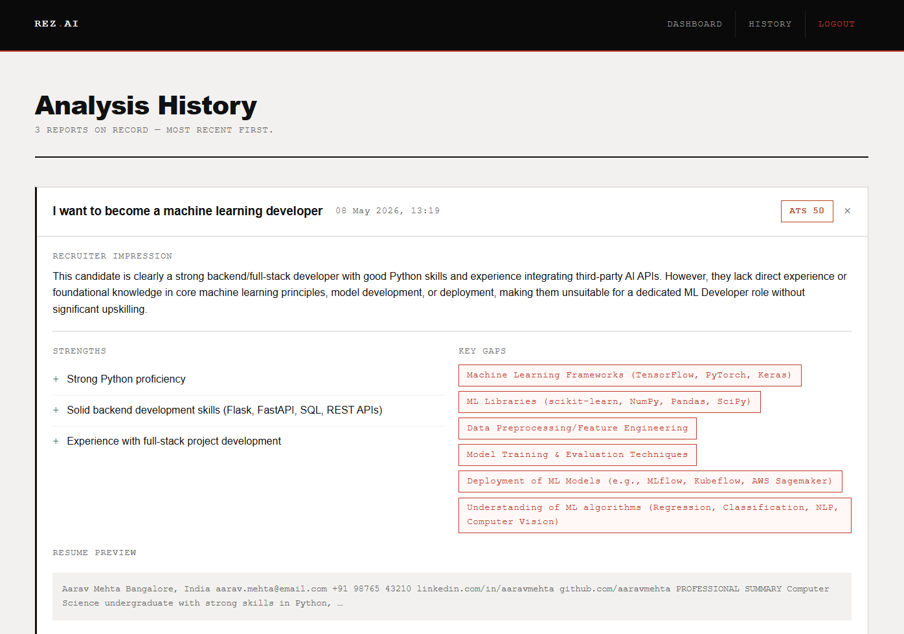

# REZ.AI — AI Resume Analyzer

A recruiter-grade resume analysis engine built with Flask, Gemini, and TiDB Cloud.
Upload or paste a resume, specify a target role, and get a structured report covering
ATS score, skill gaps, experience evaluation, and actionable next steps.

---

## Screenshots

| Dashboard | Analysis Report | History |
|-----------|-----------------|---------|
|  |  |  |

---

## Features

- **ATS Score** — numeric fit score against the target role
- **Recruiter Impression** — honest gut-reaction summary
- **Skill Gap Analysis** — present vs. missing skills, role-specific
- **Strengths & Weaknesses** — structured evaluation
- **Experience & Project Quality** — depth, relevance, specificity
- **Measurable Impact Detection** — flags whether the resume shows numbers
- **Formatting Feedback** — structure, length, layout, scannability
- **Action Plan** — prioritized, concrete improvement steps
- **Interview Preparation** — likely questions based on resume gaps
- **Analysis History** — all past reports stored and expandable
- **PDF + DOCX Upload** — or paste resume text directly
- **Responsive UI** — brutalist/editorial design, works on mobile

---

## Stack

| Layer | Technology |
|-------|------------|
| Backend | Python 3.11, Flask 3 |
| ORM | SQLAlchemy 2 |
| Database | TiDB Cloud (MySQL-compatible) |
| AI | Gemini 2.5 Flash (Google GenAI) |
| Auth | werkzeug password hashing |
| File Parsing | pdfplumber, pymupdf, python-docx |

---

## Project Structure

```
resume/
├── app.py              # Flask routes and application logic
├── ai.py               # Gemini API integration and prompt engineering
├── db.py               # SQLAlchemy engine and session setup
├── models.py           # User and Report ORM models
├── requirements.txt
├── .env.example        # environment variable template
├── .gitignore
├── ca.pem              # TiDB SSL certificate (never committed)
├── static/
│   └── style.css
└── templates/
    ├── base.html
    ├── login.html
    ├── signup.html
    ├── dashboard.html
    └── history.html
```

---

## Local Setup

### 1. Clone the repository

```bash
git clone https://github.com/your-username/rez-ai.git
cd rez-ai
```

### 2. Create a virtual environment

```bash
python -m venv venv
source venv/bin/activate      # Windows: venv\Scripts\activate
```

### 3. Install dependencies

```bash
pip install -r requirements.txt
```

### 4. Configure environment variables

```bash
cp .env.example .env
```

Open `.env` and fill in your values — see [Environment Variables](#environment-variables) below.

### 5. Add your TiDB SSL certificate

Download `ca.pem` from your TiDB Cloud cluster → **Connect** → **CA cert**.
Place it in the project root.

### 6. Run the application

```bash
python app.py
```

Visit `http://localhost:5000`.

---

## Environment Variables

| Variable | Description |
|----------|-------------|
| `FLASK_SECRET_KEY` | Random secret for session signing. Generate one: `python -c "import secrets; print(secrets.token_hex(32))"` |
| `GEMINI_API_KEY` | API key from [Google AI Studio](https://aistudio.google.com/app/apikey) |
| `DB_USERNAME` | TiDB Cloud username |
| `DB_PASSWORD` | TiDB Cloud password |
| `DB_HOST` | TiDB Cloud cluster host |
| `DB_PORT` | Database port (default: `4000`) |
| `DB_NAME` | Database name (default: `test`) |
| `DB_SSL_CA` | Path to SSL certificate (default: `./ca.pem`) |

---

## License

MIT — see [LICENSE](LICENSE).